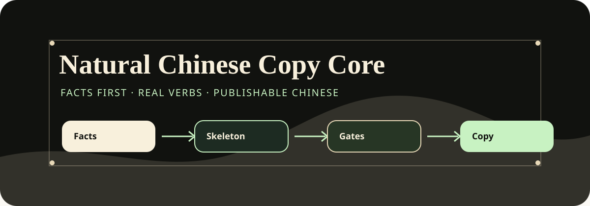
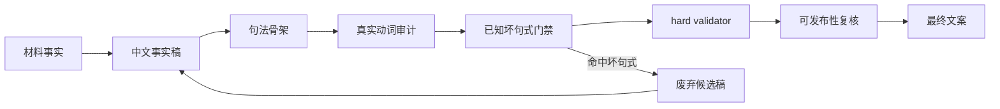
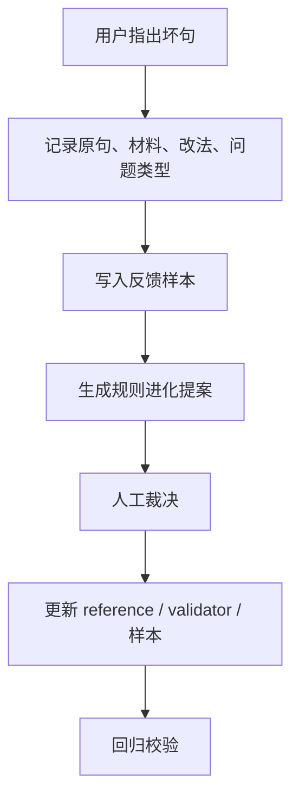

# 中文才是最屌的

## Natural Chinese Copy Core

`中文才是最屌的` 是一套给中文文案用的底层 skill。它先把材料改写成中文事实稿，再检查句法骨架、真实动词、事实边界和可发布性，最后才交付正文。

[](#安装)
[](#规则怎么工作)
[](#本地校验)

## 它解决什么

很多中文稿的问题不在词，而在句子背后的结构：英文语序、虚假动词、反例转折、假口语、主谓宾不搭、把 validator pass 当成交付通过。

这个 skill 把这些问题拆成可检查的门禁：

- 先写中文事实稿，避免从英文句子顺序开始改。
- 每个关键句都查主语、谓语、宾语、结果和省略主语。
- 谓语必须是主语真的能做的动作，不能用翻译腔动词补位。
- 命中已知坏句式的候选稿直接废弃，重新从事实稿写。
- 机器校验通过后，还要人工查文本类型、读者、渠道和可发布性。
- 用户反馈先进样本和提案，再决定是否变成规则。

## 包结构

```text
natural-chinese-copy-core/
├── SKILL.md                  # Codex 当前默认入口
├── SKILL.codex.md            # Codex 发布说明
├── SKILL.claude.md           # Claude 安装入口，安装时可重命名为 SKILL.md
├── README.md                 # GitHub 说明
├── README_HANDOFF.md         # 本地交接说明
├── assets/
│   └── natural-chinese-copy-core-banner.svg
├── references/               # 规则、样本、可发布性门禁、反馈进化协议
└── scripts/                  # 本地校验脚本
```

## 规则怎么工作



核心原则很简单：坏候选不修，直接丢；从事实稿重新写。

## 安装

### Codex

把整个目录放进 Codex skills 目录，保留 `SKILL.md`：

```text
C:\Users\<you>\.codex\skills\natural-chinese-copy-core\
```

`SKILL.codex.md` 只作为发布说明，真正入口仍是 `SKILL.md`。

### Claude

把整个目录放进 Claude skills 目录后，将 `SKILL.claude.md` 复制或重命名为该安装目录里的 `SKILL.md`。

共享内容不需要拆：

```text
references/
scripts/
assets/
```

Claude 入口会读取同一套 `references/`。如果本地环境不能跑 Node.js，仍可按文件里的 hard gate 手工审稿。

## 本地校验

常用命令：

```bash
node natural-chinese-copy-core/scripts/validate_chinese_copy.mjs --file <copy-file>
node natural-chinese-copy-core/scripts/validate_chinese_copy.mjs --require-tool-project-opening --file <tool-copy-file>
node natural-chinese-copy-core/scripts/validate_fact_grounding.mjs --source <source-file> --output <output-file>
```

改规则或样本后，至少跑：

```bash
node natural-chinese-copy-core/scripts/validate_rule_language.mjs --file natural-chinese-copy-core/SKILL.md
node natural-chinese-copy-core/scripts/validate_feedback_cases.mjs --file natural-chinese-copy-core/references/feedback_sample_cases.jsonl
node natural-chinese-copy-core/scripts/validate_legacy_issue_coverage.mjs
node natural-chinese-copy-core/scripts/run_self_evolution_copy_lab.mjs --file natural-chinese-copy-core/references/self_evolution_cases.jsonl --out .tmp/self_evolution_copy_lab.md --json-out .tmp/self_evolution_copy_lab.json --require-stable-zero=3
```

## 反馈怎么进规则



这条链路保护两个东西：用户的个性化偏好能留下来，单次情绪反馈又不会误伤其它正常表达。

## 外部审稿

外部 reviewer 默认关闭。只有用户明确要求多方审稿时，才读取 `references/external_model_reviewers.md`。

外部意见只能作为审稿输入。每个参与方都要记录状态：`pass`、`configured`、`unavailable` 或 `error`。不可用的 reviewer 不能写成已经参与。

## 适合的任务

- 中文文案、推文、帖子、介绍、推荐、摘要。
- GitHub repo、开源工具、README、技术项目介绍。
- 产品更新、课程资料、活动通知、招聘帖、邮件邀约。
- 审稿、评稿、坏句标注、规则蒸馏、个性化 skill 调整。

## 不负责的事

- 不抓取来源。
- 不验证实时数据。
- 不生成图片。
- 不发布内容。
- 不替上层业务 skill 保存产品字段。
- 不把单条反馈直接升级成 hard rule。

## 发布前建议

上传 GitHub 前可以保留这几个文件：

- `SKILL.md`
- `SKILL.codex.md`
- `SKILL.claude.md`
- `README.md`
- `README_HANDOFF.md`
- `assets/`
- `references/`
- `scripts/`

如果需要声明开源协议，请在仓库根目录补 `LICENSE`。
